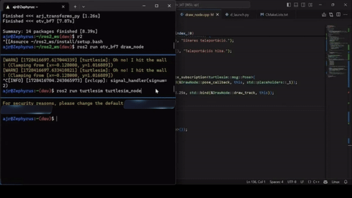

# `otv_bf7` ROS 2 package
This package consists of three nodes:

1. `/draw_node`: This node is responsible for drawing a predefined path in the turtlesim environment. It uses the `geometry_msgs/Twist` message type to control the turtle's movement and the `turtlesim/srv/SetPen` service to set the pen color and width. Additionally, it utilizes the `turtlesim/srv/TeleportAbsolute` service to teleport the turtle to specific coordinates after completing the drawing. The node subscribes to the `/turtle1/pose` topic to track the turtle's position and ensure accurate movement along the specified path.

2. `/iranyitas`: This node enables manual control of the turtle using keyboard inputs. It listens for specific key presses ('w', 'a', 's', 'd') to move the turtle forward, backward, and to rotate it. The turtle's movement is published to the `/turtle1/cmd_vel` topic using the `geometry_msgs/Twist` message type. 

3. `/overlay`: This node displays a simple overlay window with game instructions and objectives using `OpenCV`. It provides a visual guide for users on how to run the other nodes and outlines the goal of the game. The overlay window will close when the ESC key is pressed.

The implementation is designed to run under ROS 2 Humble.
### Clone the packages
>It is assumed that the workspace is `~/ros2_ws/`.
``` 
cd ~/ros2_ws/src
```
```
git clone https://github.com/Sl4yM4yd4y/otv_bf7
```
## Build this ROS 2 package
>It is assumed that the workspace is still `~/ros2_ws/`.
```
cd ~/ros2_ws
```
```
colcon build --packages-select otv_bf7 --symlink-install
```
## Run this ROS 2 package
<details>
<summary> Don't forget to source before ROS commands.</summary>
source ~/ros2_ws/install/setup.bash
</details>

Follow the order of instructions for optimal use:
>To display the rules of the game in a new overlay window:
```
1. ros2 run otv_bf7 overlay
```
<details>
<summary>You have to close the overlay before making the second step!</summary>
Press the 'ESC' button to close it.
</details>

>To draw the track for the game
```
2. ros2 run otv_bf7 draw_node
```
>To gain control over the turtle
```
3. ros2 run otv_bf7 iranyitas
```
**If the turtle doesn't move with 'w','a','s','d' , split the screen, one side wsl/terminal, other side turtlesim, click into the terminal and try the movements again!**

## The track 

<table align ="center">
  <tr>
    <td>
      
    </td>
    <td>
      
    </td>
  </tr>
</table>

## The drawing process

<div align="center">
  
</div>

## Diagram

